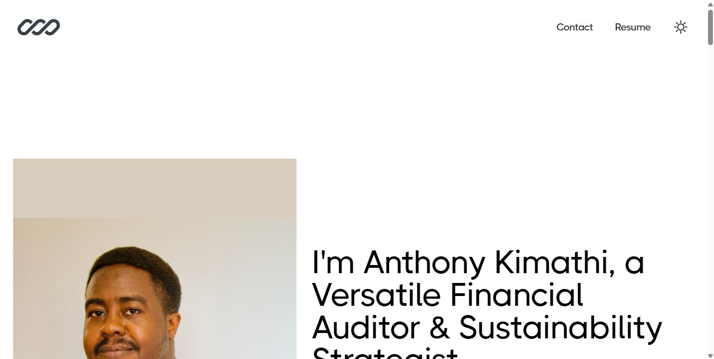

### Anthony Njeru's Portfolio Website

Welcome to my portfolio website, showcasing my expertise and projects.

**Preview**


## Technologies Used

- **React**: JavaScript library for building user interfaces.
- **Vite**: Fast build tool that focuses on speed and performance.
- **TypeScript**: Typed superset of JavaScript that improves code quality and developer productivity.
- **Tailwind CSS**: Utility-first CSS framework for rapidly building custom designs.

## Features

- Responsive design for optimal viewing across devices.
- Portfolio section highlighting financial modeling, sustainable finance, and compliance auditing projects.
- Contact form for collaboration and inquiries.
- Integration with social media and professional profiles.

## Setup

Make sure to install the dependencies:

```bash
# yarn
yarn install

# npm
npm install
```

## Development Server

Start the development server on http://localhost:5173

```bash
npm run dev
```

## Production

Build the application for production:

```bash
npm run build
```

Locally preview production  build:

```bash
npm run preview
```

